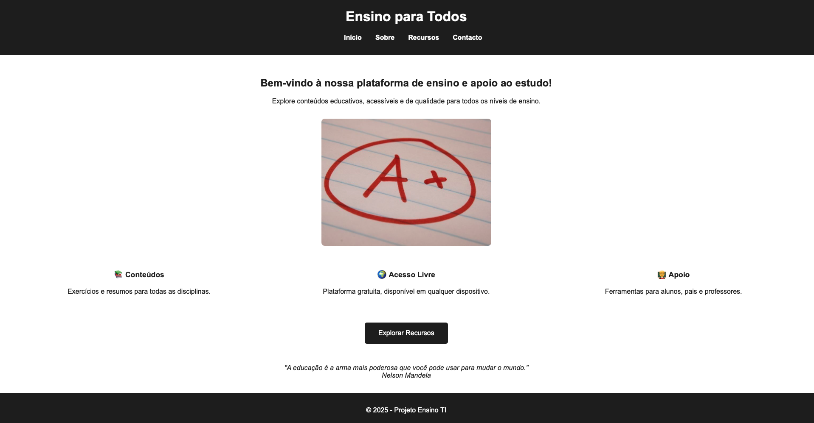
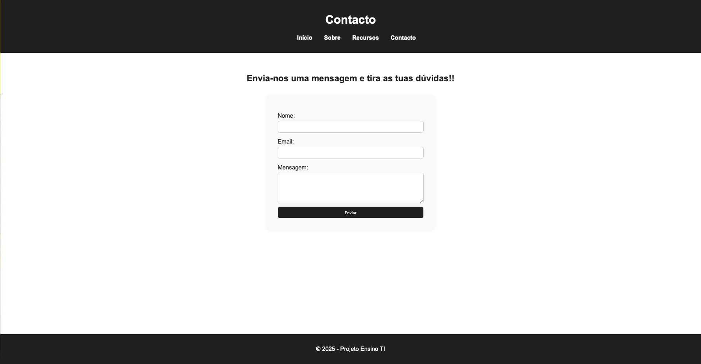
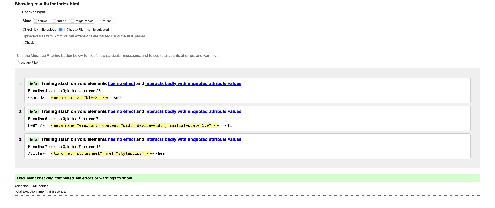
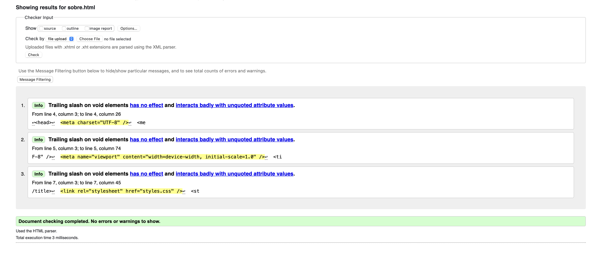
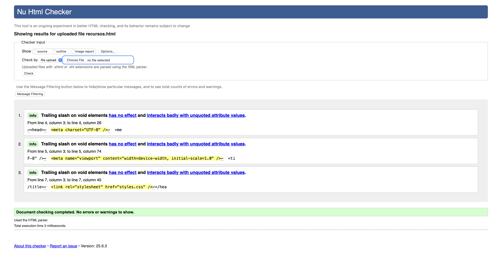
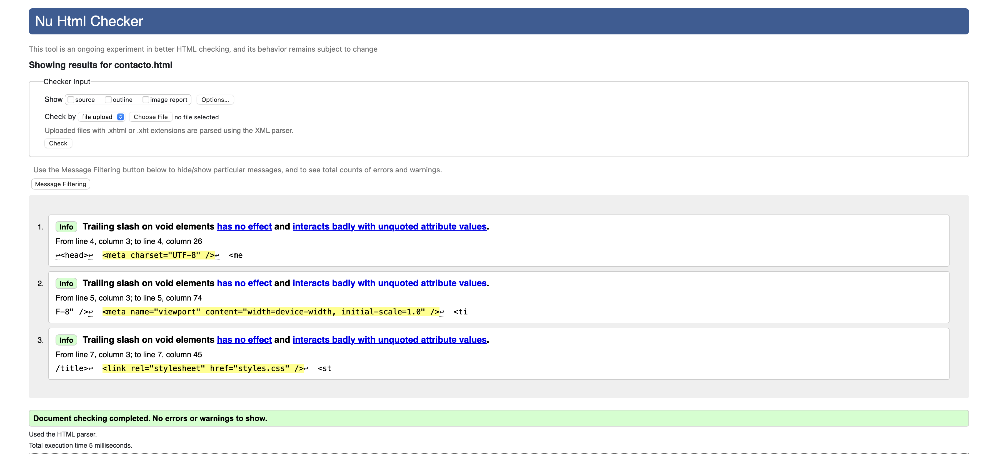

# Ensino para Todos

Repositório para alojar o projeto desenvolvido na unidade curricular de Tecnologias e Internet, 1º ano da licenciatura. Desenvolvido pelo elemento [@duarte35](https://github.com/duarte35).

## Descrição do Projeto

O projeto consiste numa plataforma educativa estática com conteúdos gratuitos para apoio ao estudo de alunos dos 2.º e 3.º ciclos. Foi utilizado HTML5, CSS3 e JavaScript para cumprir todos os requisitos definidos no enunciado.

## Organização do Repositório

* **Ficheiros HTML**: páginas principais (`index.html`, `sobre.html`, `recursos.html`, `contacto.html`) 
* **Estilos CSS**: ficheiro central `styles.css` 
* **JavaScript**: `script.js` para carregamento dinâmico de conteúdo XML 
* **Conteúdo XML**: `conteudos.xml` com dados estruturados e `schema.xsd` para validação 
* **Imagens**: incluídas através de URLs [imagens](doc/images)

## Galeria de Resultados

| Página Inicial                          |     Sobre                           |
|---------------------------------------- |--------------------------------------|
|          |      |

| Conteudos                               | Contactos                           |
|----------------------------------------|--------------------------------------|
|  |  |

> Capturas de ecrã ilustrativas das páginas principais desenvolvidas.

## Tecnologias Utilizadas

* [HTML5](https://developer.mozilla.org/pt-PT/docs/Web/HTML)
* [CSS3](https://developer.mozilla.org/pt-PT/docs/Web/CSS)
* [JavaScript](https://developer.mozilla.org/pt-PT/docs/Web/JavaScript)
* [XML + XSD](https://www.w3schools.com/xml/schema_intro.asp)

### Bibliotecas e Ferramentas

* Nenhuma biblioteca externa foi usada para cumprir os critérios do trabalho (sem Bootstrap, sem jQuery).
* Validação dos ficheiros feita via [W3C Validators](https://validator.w3.org/).

* | Página Inicial                          |     Sobre                           |
|----------------------------------------|--------------------------------------|
|         |  |

| Conteudos                               | Contactos                           |
|----------------------------------------|--------------------------------------|
|  |  |

## Relatório

### Capítulo 1: Apresentação do Projeto  
- Plataforma com 4 páginas estáticas para consulta e apoio ao estudo [Apresentação](doc/cd1.md)
- Integração de conteúdos XML de forma dinâmica usando JavaScript [Apresentação](doc/cd1.md)

### Capítulo 2: Interface Gráfica
- Interface responsiva [Interface](doc/cd2.md)
- Utilização de Flexbox para disposição de elementos [Interface](doc/cd2.md)
- Estilo uniforme com CSS externo [Interface](doc/cd2.md)

### Capítulo 3: Produto Final
- Conteúdos organizados por disciplina e ciclo de ensino [Produto Final](doc/cd3.md)
- Carregamento automático de cartões educativos a partir de `conteudos.xml` [Produto Final](doc/cd3.md)

### Capítulo 4: Validação e Conclusão
- Testado com validadores HTML e CSS [Validação e Conclusão](doc/cd4.md)
- Cumprimento de todos os requisitos definidos no enunciado [Validação e Conclusão](doc/cd4.md)

## Equipa

* Duarte Ferreira [@duarte35](https://github.com/duarte35)
